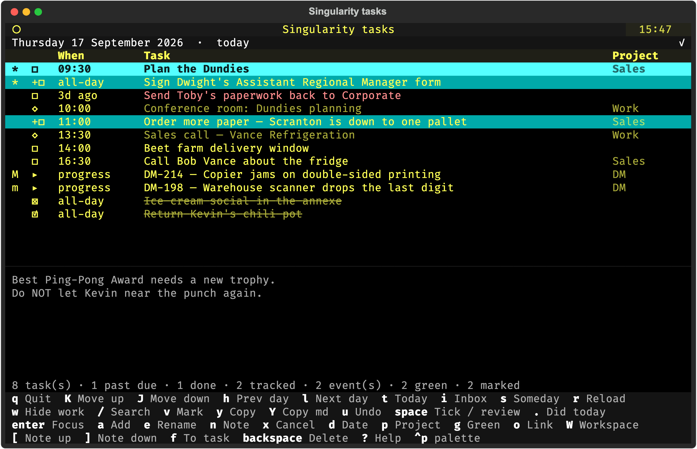
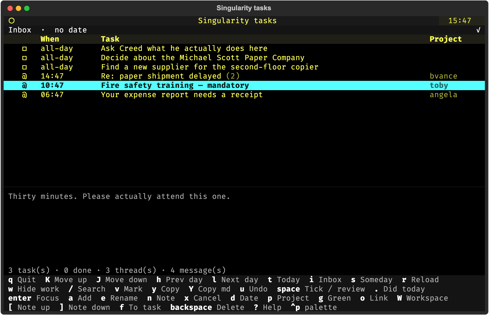

# MyTasks

A terminal task board for [SingularityApp](https://singularity-app.com/), with
the day's calendar, the issues you are working on and the mail you have not
decided about on the same list as your tasks.

It is a personal tool, published because the shape of it might be useful to
somebody else. Everything below is real behaviour; the data in the pictures is
invented — they are taken from the board itself by `docs/screenshots.py`,
against a stubbed store, so a new feature can be shown by adding a board to
that file and running it.



## Four sources, one list

The board draws rows from four places and keeps them apart without keeping them
in separate windows:

| | mark | where it appears | what it is |
|---|---|---|---|
| tasks | `☐ ☑ ☒` | every view | yours, the only rows the board writes to |
| calendar | `◇` | today and any day | placed among the tasks by the hour they happen |
| issue tracker | `▸` | today only | what is assigned to you and in progress |
| mail | `@` | the inbox | messages you have not decided about, folded into threads |

A row from one of the other three refuses the writes that would change it, and
says so rather than failing quietly. Two keys do work on them: `o` opens what a
row points at, and `f` turns a message into a task on today.

Everything else treats them alike. They are counted, hidden by the search, hidden
by the work filter, marked and copied exactly as a task is.



## The day, the inbox, and someday

`h` and `l` walk the days, `t` jumps to today. `i` is the inbox — tasks with no
date, and the mail queue below them. `s` is someday, for what has been put off.

Inside a day the order is the board's, not yours to fight: unfinished before
finished, past due first, then by time of day, then by the order you set with
`K` and `J`. A task that is overdue says how overdue — `3d ago` rather than a
date you have to subtract from today.

## Marking, and acting on the set

`v` marks the row under the cursor and moves down, so a run of rows is five
presses. Marks survive moving between views, so you can gather rows from three
different days and then act on all of them.

Every write key then acts on the marked set instead of the cursor: tick, cancel,
delete, date, project, tag, note. One confirmation for the set, one undo for the
set, and rows that are not the board's to change are passed over and counted
rather than silently skipped.

The status line says how many rows are marked — including marks on rows this view
is not showing, which is the only place such a mark is visible at all.

## Taking tasks in and out

Two copy keys, because two editors want different things:

```
y            Order more paper — Scranton is down to one pallet
             Sign Dwight's Assistant Regional Manager form

Y            - [ ] Order more paper — Scranton is down to one pallet
             - [x] ~~Ice cream social in the annexe~~
```

`y` gives plain lines, for an editor that writes the list markup itself.
`Y` gives markdown, which is the form a paste can read back: a plain line says
nothing about whether a task was done.

Pasting works the other way round. Paste any lines into the board and each one
becomes a task in the view you are looking at — bullets, numbers and checkboxes
stripped, a ticked box making a finished task, blank lines skipped. One press of
`u` removes the whole paste.

So a set of tasks can go out to a plain-text planner, be broken down there, and
come back.

## The rest of it

**Optimistic.** A tick, a rename, a date change shows immediately and is sent
behind you. The status line says how many writes are in flight; `u` undoes the
last one, then the one before it.

**A tag that means "today".** One tag from your account is drawn with a `*` and
sorts to the top of its band. `g` puts it on and takes it off.

**Hiding work.** `w` hides the rows belonging to a work project — tasks, events
and issues alike. A working window in the configuration can do it for you, so
work disappears at six and comes back in the morning.

**Search.** `/` narrows every source to the rows whose title contains what you
type, and stays on as you move between views.

**Notes.** `enter` shows the selected row in full, with its note; `[` and `]`
scroll it. A calendar event's description and a message's body arrive in the
same place.

**A workspace.** `W` hands a tracker row's key, project and versions to a
program of your choosing — for making a branch, a directory, whatever you do at
the start of a piece of work.

**Both alphabets.** Every key is bound twice, to the Latin letter and to
whatever a Russian layout types on the same physical key, so a Russian title
costs no layout switching.

## Getting started

```sh
git clone <this repository>
cd MyTasks
echo 'SINGULARITY_TOKEN=<your token>' > .env
./run.sh
```

`run.sh` builds the virtualenv on first use and keeps it in step with
`requirements.txt`. Written and run on macOS; the calendar integration is
macOS-only, and nothing else has been tried elsewhere.

```sh
./run.sh                 # today
./run.sh 2026-09-05      # a particular day
./run.sh --cli           # print today's tasks and exit, no interface
```

## Configuration

`.env`, beside the code. Only the first line is needed; everything else turns
on a feature and is ignored when absent.

| | |
|---|---|
| `SINGULARITY_TOKEN` | your account's API token |
| `WORK_PROJECT` | the project `w` hides |
| `WORK_HOURS`, `WORK_DAYS` | when work is hidden for you, e.g. `08:00-18:00`, `mon-fri` |
| `GREEN_TAG` | the tag drawn with a star |
| `CALENDAR_WORK`, `CALENDAR_PERSONAL` | which calendar accounts to read |
| `YOUTRACK_BASE_URL`, `YOUTRACK_TOKEN`, `YOUTRACK_ASSIGNEE` | the issue tracker |
| `YOUTRACK_PROJECTS`, `YOUTRACK_STATES`, `YOUTRACK_VERSION_FIELD` | which issues count |
| `MAIL_MAILDIR`, `MAIL_FOLDERS` | a locally mirrored mailbox to read |
| `MAIL_EWS_URL`, `MAIL_ARCHIVE_FOLDER` | the account, for filing a message away |

`?` shows every key, in the board itself.

## Tests

```sh
python tests/run.py              # the self-contained suites: no credentials, no network
python tests/run.py --store      # those that talk to the task store
python tests/run.py --all        # every tier this machine can, naming what it skips
python tests/run.py t_search     # one suite, wherever it lives
```

One directory per tier, and the directory is a suite's whole declaration of what
it needs. The self-contained tier is 54 suites and 2,752 checks, runs against
a stubbed store and substituted sources, and passes on a fresh clone with
nothing configured.

Each suite names the parts it is made of, so a part can be selected, reported
and re-run on its own:

```sh
.venv/bin/python -m pytest tests/stub/t_still.py -k ticking_holds
.venv/bin/python -m pytest tests/stub/t_still.py --lf     # only what failed last time
```

The suites that talk to the real account use a second token, are paced apart,
name everything they create `zz-`, delete it afterwards, and tell a quota
refusal apart from a failure.

## How it is put together

| | |
|---|---|
| `main.py` | the application: keys, screens, writes, undo |
| `board.py` | what is drawn — decided from state alone, with no terminal |
| `singularity.py` | the task store's API, and the ordering |
| `ical.py`, `tracker.py`, `mail.py`, `gateway.py` | the other three sources |
| `openspec/` | what the board must do, as requirements and scenarios |
| `docs/screenshots.py` | the pictures above, taken from the board on invented data |

`openspec/specs/` is the description the code is held to — 161 requirements and
778 scenarios about behaviour rather than implementation. Changes are proposed,
specified, applied and archived against it.
